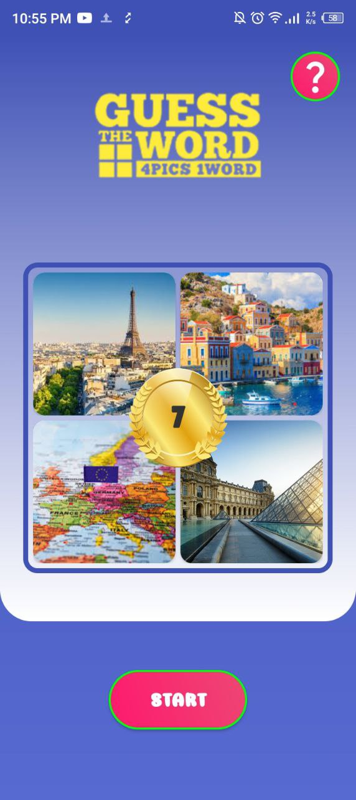
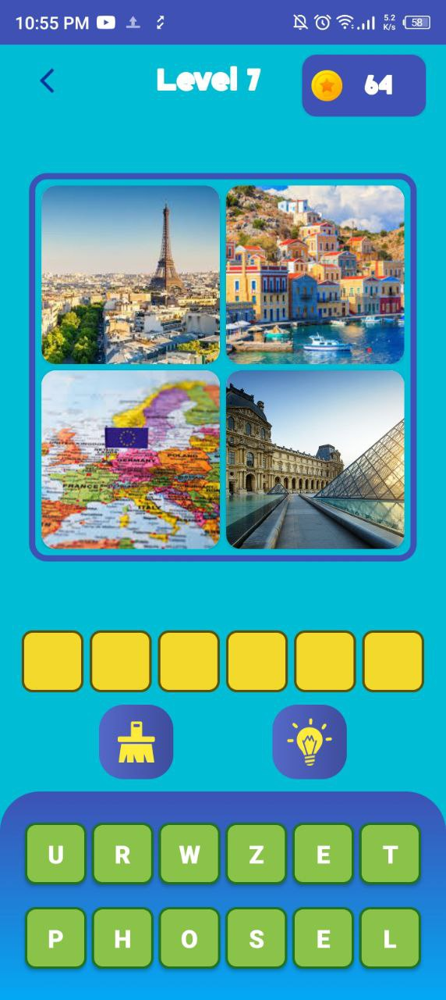
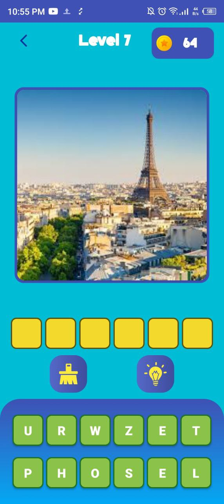
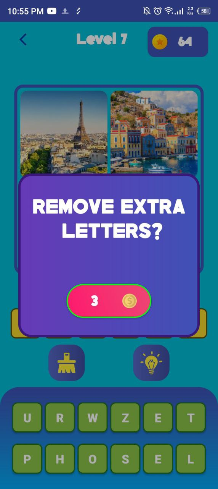
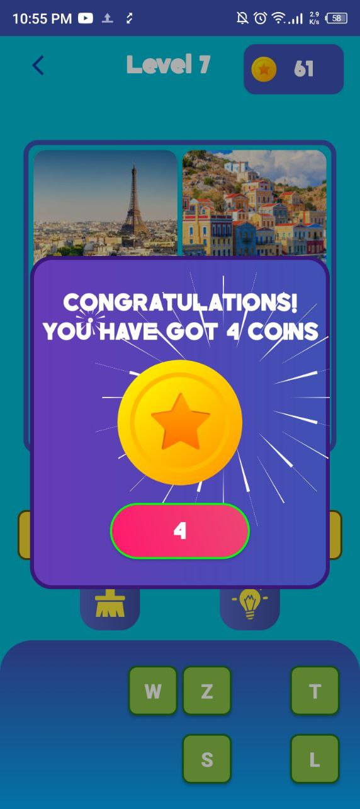
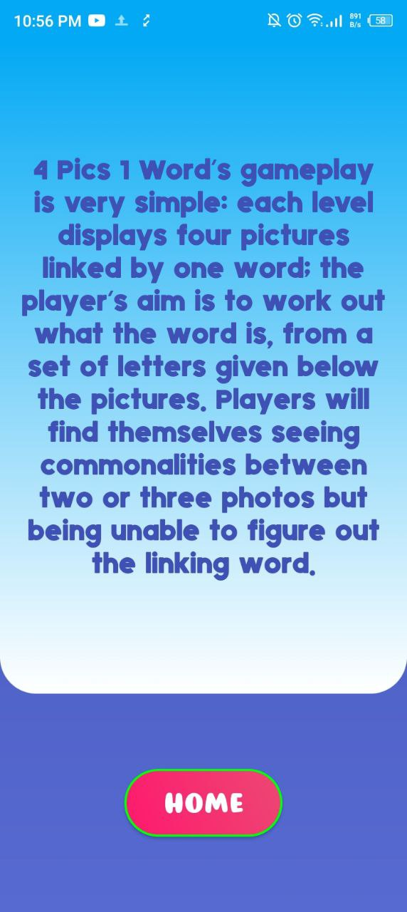

# 4Pics1Word Game (Android)

Welcome to the 4Pics1Word Game app repository! This app challenges players to find a word that summarizes four pictures. It is developed using native Android technologies and provides an engaging and interactive puzzle experience.

---

### 📱 App Overview

4Pics1Word is a popular word puzzle game where the player is shown four images and must guess the word that connects them. The app includes animations for smooth transitions, saves user progress using SharedPreferences, and uses the MVP (Model-View-Presenter) architecture for better code structure.

---

### ⚙️ Technologies Used

- **Activity**: Used to create the main interface and handle user interactions.
- **XML**: Used for designing the UI layout of the app.
- **SharedPreferences**: Used to store user progress and high scores.
- **MVP (Model-View-Presenter)**: Follows the MVP architecture pattern to manage the separation of concerns between UI and business logic.
- **Animation**: Adds smooth animations to make the gameplay more engaging.

---

### 🖼️ Screenshots

<table>
  <tr>
    <td></td>
    <td></td>
    <td></td>
  </tr>
  <tr>
    <td></td>
    <td></td>
    <td></td>
  </tr>
</table>

---

### 📋 Features

- **Puzzle Gameplay**: Guess the word that connects four images.
- **User Progress**: Game progress and high scores are saved using SharedPreferences.
- **MVP Architecture**: The app uses the MVP pattern for better separation of concerns and testability.
- **Smooth Animations**: Enjoy smooth and interactive animations during gameplay.
- **Responsive Design**: The game interface is optimized for different screen sizes.

---